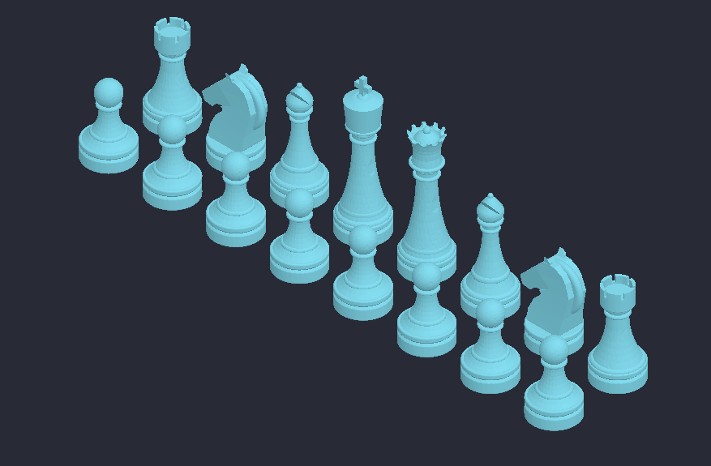

# CHESSBITS

A simple python program that creates 3D models for a chess set.

NOTE: The above image was created with the prototype script, which can be found in `prototype/chess.py`

Creates:

* pawn
* rook
* knight
* bishop
* queen
* king

Allows control over:

* which pieces are generated (all by default)
* scale of the output piece(s)
* some additional parameters:
    * base diameter
    * piece height
    * diameter of the top of the piece